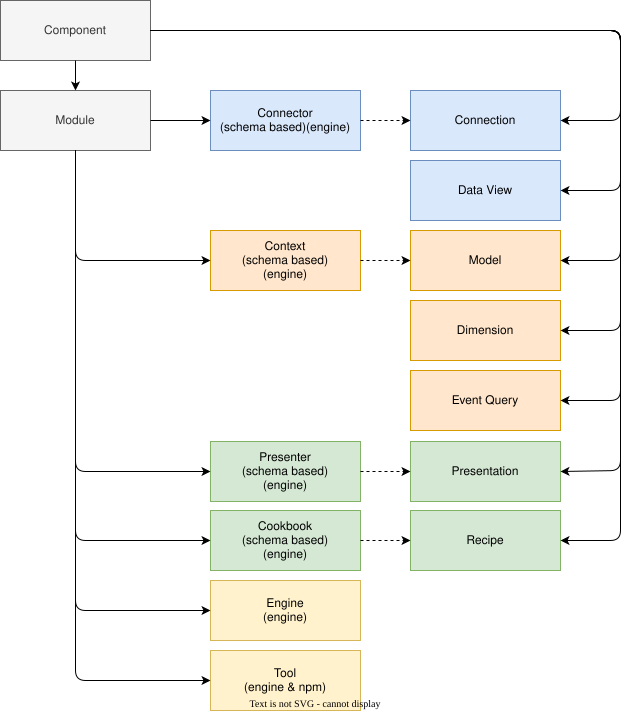

# DPUse Shared Library

[](./LICENSE)
[](https://www.npmjs.com/package/@dpuse/dpuse-shared)
[](https://github.com/dpuse/dpuse-shared/actions/workflows/codeql.yml)
[](https://sonarcloud.io/summary/new_code?id=dpuse_dpuse-shared)
[](https://github.com/dpuse/dpuse-shared/actions/workflows/ci.yml)

## Introduction

@dpuse/dpuse-shared is the foundational library for the [DPUse](https://www.dpuse.app/) ecosystem. It provides the common constants, types, errors, and utilities that are shared across all DPUse modules — including the App, API, Engine, Connectors, Contexts, Presenters and Recipes.

The library is written in TypeScript and designed to be consumed exclusively by TypeScript projects. All configuration types are schema-validated using [Valibot](https://valibot.dev/), giving consumers both compile-time safety and runtime validation from a single source of truth.

## Table of Contents

## Prerequisites

The following are required to use this library:

| Prerequisite                                  | Version |
| --------------------------------------------- | :-----: |
| [Node.js](https://nodejs.org/)                | ≥ 22.0  |
| [npm](https://www.npmjs.com/)                 | ≥ 11.0  |
| [TypeScript](https://www.typescriptlang.org/) |  ≥ 6.0  |

## Installation

`@dpuse/dpuse-shared` is published to the [public npm registry](https://www.npmjs.com/package/@dpuse/dpuse-shared). Install it using your preferred package manager:

```bash
# npm
npm install @dpuse/dpuse-shared

# yarn
yarn add @dpuse/dpuse-shared

# pnpm
pnpm add @dpuse/dpuse-shared
```

This package has no peer dependencies.

## Usage

This package uses [sub-path exports](https://nodejs.org/api/packages.html#subpath-exports). Import only the entry points you need:

```ts
import { getComponentStatus } from '@dpuse/dpuse-shared/component';
import type { ConnectorConfig } from '@dpuse/dpuse-shared/component/module/connector';
import { ConnectorError, serialiseError } from '@dpuse/dpuse-shared/errors';
import { formatNumberAsDuration } from '@dpuse/dpuse-shared/utilities';

try {
    // The locator argument follows the convention 'project.file.function'
    throw new ConnectorError('Connection failed.', 'connector.connection.read');
} catch (error) {
    const serialised = serialiseError(error);
}
```

Implements the common Data Positioning repository management command set. For more information see [@dpuse/dpuse-development](https://github.com/dpuse/dpuse-development).

## Architecture

### Component Hierarchy

`Component` is the foundational base type for all DPUse components. All component types extend `ComponentConfig` and are logically grouped in the following hierarchy. `Module` is a component type whose implementations are dynamically loaded by the host modules (App and API):



### Cross-cutting Concerns

The following are shared across all modules and are not part of the domain model:

| Concern   | Description                                                                                                                                                                                                                                                                                                                                            |
| --------- | :----------------------------------------------------------------------------------------------------------------------------------------------------------------------------------------------------------------------------------------------------------------------------------------------------------------------------------------------------- |
| Encoding  | Character encoding types with detection and decodability flags, a static catalogue of all supported encodings loaded from JSON, and an action to retrieve them in sorted order.                                                                                                                                                                        |
| Errors    | A typed error hierarchy (`DPUseError`, `AppError`, `APIError`, `EngineError`, `ConnectorError`, `FetchError`) with serialisation and deserialisation for transporting errors across API and worker boundaries, plus utilities for normalising unknown throwables, constructing errors from HTTP responses, and suppressing best-effort cleanup errors. |
| Locale    | Locale and flag identifiers, localised label, description and verb types, Valibot schemas for locale fields, supported language constants, and actions for resolving and applying locale-specific values to configuration objects.                                                                                                                     |
| Utilities | OData-to-internal type conversion, file path name and extension extraction, number formatting as decimal, whole number, compact size, storage size and duration, and MIME type lookup by file extension.                                                                                                                                               |

## API Reference

### `@dpuse/dpuse-shared/component`

| Category | Exports |
| -------- | ------- |
| Schema | `componentConfigSchema` |
| Types | `Component`, `ComponentConfig`, `ComponentReference`, `ComponentStatus`, `ComponentStatusColorId` |
| Functions | `getComponentStatus(id, localeId?)` |

### `@dpuse/dpuse-shared/component/connection`

| Category | Exports |
| -------- | ------- |
| Types | `ConnectionConfig`, `ConnectionAuthorisationConfig`, `ConnectionDescriptionConfig`, `ConnectionNodeConfig`, `DPAFileSystemFileHandle`, `NodeTypeId`, `ObjectColumnConfig`, `StorageTypeId` |

### `@dpuse/dpuse-shared/component/dataView`

| Category | Exports |
| -------- | ------- |
| Constants | `ORDERED_VALUE_DELIMITER_IDS` |
| Types | `DataViewConfig`, `DataViewInterface`, `PreviewConfig`, `ContentAuditConfig`, `RelationshipsAuditConfig`, `DataFormatId`, `RecordDelimiterId`, `ValueDelimiterId`, `ParsingRecord`, `ParsingResult`, `DataTypeId`, `DataSubtypeId`, `NumericSubtypeId`, `NumericSignId`, `NumericUnitsId`, `StringSubtypeId`, `TemporalSubtypeId`, `InferenceSummary`, `InferenceRecord`, `InferenceResult`, `BooleanInferenceResult`, `NumericInferenceResult`, `BigIntInferenceResult`, `NumberInferenceResult`, `StringInferenceResult`, `TemporalInferenceResult`, `UnknownInferenceResult` |

### `@dpuse/dpuse-shared/component/dimension`

| Category | Exports |
| -------- | ------- |
| Types | `DimensionConfig` |

### `@dpuse/dpuse-shared/component/eventQuery`

| Category | Exports |
| -------- | ------- |
| Types | `EventQueryConfig` |

### `@dpuse/dpuse-shared/component/module`

| Category | Exports |
| -------- | ------- |
| Types | `ModuleConfig`, `ModuleTypeId` |

### `@dpuse/dpuse-shared/component/module/connector`

| Category | Exports |
| -------- | ------- |
| Schema | `connectorConfigSchema` |
| Constants | `CONNECTOR_ACTION_NAME_MAP` |
| Types | `ConnectorInterface`, `ConnectorActionName`, `ConnectorConstructor`, `ConnectorUtilities`, `ConnectorConfig`, `AuditObjectContentOptions`, `AuditObjectContentOptions1`, `AuditObjectContentResult`, `AuditObjectContentResult1`, `CreateObjectOptions`, `DescribeConnectionOptions`, `DropObjectOptions`, `FindObjectOptions`, `FindObjectResult`, `GetReadableStreamOptions`, `GetRecordOptions`, `GetRecordResult`, `ListNodesOptions`, `ListNodesResult`, `PreviewObjectOptions`, `RecordRetrievalTypeId`, `RemoveRecordsOptions`, `RetrieveChunksOptions`, `RetrieveRecordsOptions`, `RetrieveRecordsSummary`, `UpsertRecordsOptions` |
| Functions | `constructConnectorCategoryConfig(id, localeId?)`, `getConnectorActionsTable(supported)` |

### `@dpuse/dpuse-shared/component/module/context`

| Category | Exports |
| -------- | ------- |
| Schema | `contextConfigSchema` |
| Types | `ContextInterface`, `ContextConfig`, `ContextActionName`, `ContextModelGroupConfig`, `ListContextOptions`, `ListContextResult` |

### `@dpuse/dpuse-shared/component/module/context/model`

| Category | Exports |
| -------- | ------- |
| Types | `ContextModelConfig`, `ContextModelDimensionGroupConfig`, `ContextModelEntityGroupConfig`, `ContextModelSecondaryMeasureGroupConfig` |

### `@dpuse/dpuse-shared/component/module/context/model/dimension`

| Category | Exports |
| -------- | ------- |
| Types | `ContextModelDimensionConfig`, `ContextModelDimensionHierarchyConfig` |

### `@dpuse/dpuse-shared/component/module/context/model/entity`

| Category | Exports |
| -------- | ------- |
| Types | `ContextModelEntityConfig` |

### `@dpuse/dpuse-shared/component/module/context/model/entity/dataItem`

| Category | Exports |
| -------- | ------- |
| Types | `ContextModelEntityDataItemConfig` |

### `@dpuse/dpuse-shared/component/module/context/model/entity/event`

| Category | Exports |
| -------- | ------- |
| Types | `ContextModelEntityEventConfig` |

### `@dpuse/dpuse-shared/component/module/context/model/entity/primaryMeasure`

| Category | Exports |
| -------- | ------- |
| Types | `ContextModelEntityPrimaryMeasureConfig` |

### `@dpuse/dpuse-shared/component/module/context/model/secondaryMeasure`

| Category | Exports |
| -------- | ------- |
| Types | `ContextModelSecondaryMeasureConfig` |

### `@dpuse/dpuse-shared/component/module/engine`

| Category | Exports |
| -------- | ------- |
| Types | `EngineConfig`, `EngineRuntime`, `EngineWorker`, `EngineInitialiseOptions`, `EngineAuthActionOptions`, `EngineConnectorActionOptions`, `EngineContextActionOptions`, `EngineCallbackData` |

### `@dpuse/dpuse-shared/component/module/presenter`

| Category | Exports |
| -------- | ------- |
| Schema | `presenterConfigSchema` |
| Types | `PresenterInterface`, `PresenterActionName`, `PresenterConfig` |

### `@dpuse/dpuse-shared/component/module/presenter/presentation`

| Category | Exports |
| -------- | ------- |
| Types | `PresentationConfig`, `PresentationVisualConfig`, `PresentationVisualContentConfig`, `PresentationVisualViewConfig`, `PresentationCategoryId`, `PresentationView`, `PresentationVisualCartesianChartViewConfig`, `PresentationCartesianTypeId`, `PresentationVisualChordDiagramViewConfig`, `PresentationVisualPeriodFlowBoundariesChartViewConfig`, `PresentationVisualPolarChartViewConfig`, `PresentationPolarTypeId`, `PresentationVisualRangeChartViewConfig`, `PresentationRangeTypeId`, `PresentationVisualSankeyDiagramViewConfig`, `PresentationVisualStreamGraphViewConfig`, `PresentationVisualValueTableViewConfig` |

### `@dpuse/dpuse-shared/component/module/tool`

| Category | Exports |
| -------- | ------- |
| Types | `ToolConfig` |
| Functions | `loadTool<T>(toolConfigs, toolId)` |

### `@dpuse/dpuse-shared/encoding`

| Category | Exports |
| -------- | ------- |
| Constants | `encodingConfigMap` |
| Types | `EncodingConfig`, `EncodingTypeConfig` |
| Functions | `getEncodingTypeConfigs(localeId?)` |

### `@dpuse/dpuse-shared/errors`

| Category | Exports |
| -------- | ------- |
| Types | `SerialisedError` |
| Classes | `DPUseError`, `AppError`, `APIError`, `EngineError`, `ConnectorError`, `FetchError` |
| Functions | `serialiseError(error?)`, `unserialiseError(serialisedErrors)`, `buildFetchError(response, message, locator)`, `normalizeToError(value)`, `concatenateSerialisedErrorMessages(serialisedErrors)`, `ignoreErrors(action)` |

### `@dpuse/dpuse-shared/locale`

| Category | Exports |
| -------- | ------- |
| Constants | `DEFAULT_LOCALE_ID`, `SUPPORTED_LANGUAGES` |
| Types | `FlagId`, `LocaleId`, `LocaleLabel`, `LocaleDescription`, `LocaleLabelMap`, `LocalisedConfig<T>` |
| Functions | `createLabelMap(labels)`, `localiseConfig(config, localeId)`, `localiseConfigs(configs, localeId, isResultSorted?)`, `resolveLabel(labels, localeId, fallbackLocaleId?)` |

### `@dpuse/dpuse-shared/utilities`

| Category | Exports |
| -------- | ------- |
| Functions | `convertODataTypeIdToUsageTypeId(oDataTypeId)`, `extractNameFromPath(itemPath)`, `extractExtensionFromPath(itemPath)`, `formatNumberAsDecimalNumber(number?, decimalPlaces?, minimumFractionDigits?, locale?)`, `formatNumberAsSize(number?, decimalPlaces?)`, `formatNumberAsStorageSize(number?, decimalPlaces?)`, `formatNumberAsDuration(number?, stopAt?)`, `formatNumberAsWholeNumber(number?, locale?)`, `lookupMimeTypeForExtension(extension?)` |

## Dependency Licenses

License data is collected automatically on each release using [license-checker](https://github.com/RSeidelsohn/license-checker-rseidelsohn). The following table lists all production dependencies. These dependencies (including transitive ones) have been checked and confirmed to use Apache-2.0, BSD-3-Clause, CC0-1.0, or MIT — all permissive, commercially-friendly licenses. Developers cloning this repository should independently verify development dependencies; users of the uploaded library are covered by these checks.

<!-- DEPENDENCY_LICENSES_START -->

| Name | Version | License(s) | Document |
| ---- | :-----: | ---------- | -------- |

<!-- DEPENDENCY_LICENSES_END -->

### Dependency Tree

The dependency tree below lists every package in this project — direct and transitive — along with its installed version, release date, and update status. Packages flagged ❗ have a newer version available; ⚠️ indicates a package that hasn't been updated in the last 6 months or longer. Neither flag necessarily indicates a problem: we let new releases stabilise before upgrading, and some packages are simply mature and stable, requiring no active development.

<!-- DEPENDENCY_TREE_START -->

<!-- DEPENDENCY_TREE_END -->

## Bundle Analysis

The Bundle Analysis Reports provide detailed breakdowns of the bundle's composition and module sizes, helping to identify which modules contribute most to the final build. Two complementary reports are generated automatically on each release:

- **[rollup-plugin-visualizer](https://github.com/btd/rollup-plugin-visualizer/tree/master)** — generates a static treemap/sunburst view based on pre-build module estimates, useful for a quick visual scan of overall bundle composition, including CSS assets.
- **[Sonda](https://sonda.dev/)** — analyses final source maps to capture the effects of tree-shaking and minification, rather than relying on pre-build estimates. This gives a more accurate picture of what's actually shipped, traces module-level dependencies, and shows the size of each module after tree-shaking and minification for more precise insight into what's driving bundle size. Note: Sonda's Vite reports currently exclude CSS files, since Vite does not generate source maps for CSS.

[View the rollup-plugin-visualizer Report](https://dpuse.github.io/dpuse-development/bundle-analysis-reports/rollup-visualiser/index.html).

[View the Sonda Report](https://dpuse.github.io/dpuse-development/bundle-analysis-reports/sonda/index.html).

## Security & Quality

### CodeQL

[CodeQL](https://github.com/dpuse/dpuse-shared/security/code-scanning) static analysis runs on every push to `main` and on a weekly schedule, scanning TypeScript, JavaScript, Rust, and GitHub Actions workflow files for security vulnerabilities and coding errors.

### SonarCloud

[SonarCloud](https://sonarcloud.io/summary/new_code?id=dpuse_dpuse-shared) performs continuous code quality and security analysis on every push, detecting bugs, code smells, and security vulnerabilities in the TypeScript source.

### Vulnerability Scanning

Two complementary tools continuously monitor dependencies for known vulnerabilities:

- **[GitHub Dependabot](https://docs.github.com/en/code-security/dependabot)** automatically raises pull requests to update vulnerable dependencies, drawing on the GitHub Advisory Database which combines NVD and npm-specific advisories.
- **npm audit** runs on every push to `main` via the CI workflow, failing the build if any high or critical severity vulnerabilities are detected.

### Supply Chain Security

[Socket.dev](https://socket.dev) monitors all dependencies for supply chain risk — detecting malicious packages, dependency confusion, typosquatting, and suspicious behaviour that may not yet have a CVE.

### Reporting Vulnerabilities

Please do not open public GitHub issues for security vulnerabilities. Use [GitHub private vulnerability reporting](https://github.com/dpuse/dpuse-shared/security/advisories/new) instead. See [SECURITY.md](./SECURITY.md) for the full disclosure policy, contact details, and expected response times.

### OpenSSF 🚧

[](https://scorecard.dev/viewer/?uri=github.com/dpuse/dpuse-shared)

This project is working towards the [OpenSSF Best Practices](https://www.bestpractices.dev) Passing badge, a self-certification covering security policy, vulnerability reporting, build processes, code quality, and more. The [OpenSSF Scorecard](https://scorecard.dev/viewer/?uri=github.com/dpuse/dpuse-shared) provides an independent automated assessment of the project's security practices and is an ongoing area of improvement.

## Contributing

This repository is maintained solely by its owner and does not accept external contributions. It is part of a larger closed application suite and is published for informational and cloning purposes only.

If you find a security vulnerability, see [Reporting Vulnerabilities](#reporting-vulnerabilities). For bugs, inconsistencies, or other feedback, you are welcome to [open a GitHub issue](https://github.com/dpuse/dpuse-shared/issues) — feedback is read, but responses and fixes are at the maintainer's discretion.

## License

This project is licensed under the MIT License, permitting free use, modification, and distribution.

[MIT](./LICENSE) © 2026-present Jonathan Terrell
