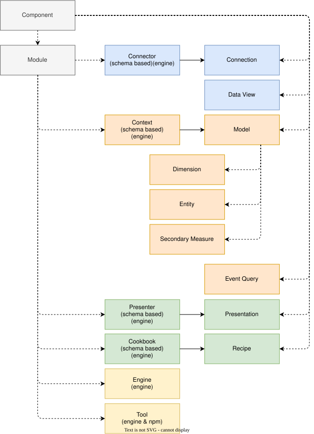

# DPUse Shared Library

<!-- OPENING_START -->

[](./LICENSE)
[](https://github.com/dpuse/dpuse-shared/releases/latest)
[](https://github.com/dpuse/dpuse-shared/actions/workflows/ci.yml)

[DPUse](https://www.dpuse.app) · [Report a Vulnerability](https://github.com/dpuse/dpuse-shared/security/advisories/new) · [Open an Issue](https://github.com/dpuse/dpuse-shared/issues)

Common constants, types and utilities used across all DPUse projects.

## About DPUse

DPUse (Data Positioning & Use) is an in-browser application that positions your data for use through three core activities: sourcing, contextualising, and publishing.

**Sourcing** uses a library of [Connectors](https://www.dpuse.app/connectors) to establish [Connections](https://www.dpuse.app) to applications, databases, file stores, and curated datasets; these connections are subsequently used to configure structured [Data Views](https://www.dpuse.app) from the underlying sources.

**Contextualising** extracts chronological events from those [Data Views](https://www.dpuse.app) and maps them into comprehensive [Context Models](https://www.dpuse.app). This gives the DPUse Engine the structural framework needed to generate deterministic transactions, facts, or observations.

**Publishing** uses a library of [Presenters](https://www.dpuse.app) to render standard [Presentations](https://www.dpuse.app) immediately using the contextualised data; additionally, [Cookbooks](https://www.dpuse.app) of [Recipes](https://www.dpuse.app) let you build Data Apps using your preferred tools.

In addition, DPUse provides [Tools](https://www.dpuse.app) used by the application, and you can use them to construct connectors and presenters.

## Introduction

@dpuse/dpuse-shared is the foundational library for the [DPUse](https://www.dpuse.app/) ecosystem. It provides the common constants, types, errors, and utilities that are shared across all DPUse modules — including the App, API, Engine, Connectors, Contexts, Presenters and Recipes.

The library is written in TypeScript and designed to be consumed exclusively by TypeScript projects. All configuration types are schema-validated using [Valibot](https://valibot.dev/), giving consumers both compile-time safety and runtime validation from a single source of truth.

<!-- OPENING_END -->

<!-- USAGE_START -->

## Usage

This [package](https://www.npmjs.com/package/@dpuse/dpuse-shared) is available on [npm](https://www.npmjs.com/). Install it with:

```bash
npm install @dpuse/dpuse-shared
```

To work on the source instead, clone this repository.

```bash
git clone https://github.com/dpuse/dpuse-shared.git
cd dpuse-shared
npm install
```

_Requires [Node.js](https://nodejs.org/) 24 or later, [npm](https://www.npmjs.com/) 12 or later, and [TypeScript](https://www.typescriptlang.org/) 6.0.3 or later._

This repository is managed using the common set of actions provided by [@dpuse/dpuse-development](https://github.com/dpuse/dpuse-development). See the `scripts` block in [package.json](https://github.com/dpuse/dpuse-shared/blob/main/package.json) for details.

<!-- USAGE_END -->

### Example

Everything is imported from the package itself. Bundlers keep only what you use:

```ts
import { ConnectorError, type ConnectorConfig, formatNumberAsDuration, getComponentStatus, serialiseError } from '@dpuse/dpuse-shared';

try {
    // The locator argument follows the convention 'project.file.function'
    throw new ConnectorError('Connection failed.', 'connector.connection.read');
} catch (error) {
    const serialised = serialiseError(error);
}
```

## Architecture

### Component Hierarchy

`Component` is the foundational base type for all DPUse components. All component types extend `ComponentInstanceConfig` and are logically grouped in the following hierarchy. `Module` is a component type whose implementations are dynamically loaded by the host modules (App and API):



### Encoding

Character encoding types with detection and decodability flags, a static catalogue of all supported encodings loaded from JSON, and an action to retrieve them in sorted order. |

### Errors

A typed error hierarchy (`DPUseError`, `AppError`, `APIError`, `EngineError`, `ConnectorError`, `FetchError`) with serialisation and deserialisation for transporting errors across API and worker boundaries, plus utilities for normalising unknown throwables, constructing errors from HTTP responses, and suppressing best-effort cleanup errors. |

### Locale

Locale and flag identifiers, localised label, description and verb types, Valibot schemas for locale fields, supported language constants, and actions for resolving and applying locale-specific values to configuration objects. |

### Utilities

OData-to-internal type conversion, file path name and extension extraction, number formatting as decimal, whole number, compact size, storage size and duration, and MIME type lookup by file extension. |

## API Reference

See [API_REFERENCE.md](./API_REFERENCE.md) for the complete API reference, including all exported schemas, types, classes, constants, and actions, grouped by topic.

<!-- DEPENDENCY_LICENSES_START -->

## Dependency Licenses

License data is updated each time `npm run document` is run, using [license-checker](https://github.com/RSeidelsohn/license-checker-rseidelsohn). The following table lists all production dependencies. These dependencies (including transitive ones) have been checked and confirmed to use BSD-3-Clause or MIT — all permissive, commercially-friendly licenses. Users of the uploaded library are covered by these checks; developers cloning this repository should independently verify development dependencies.

| Dependency                                                             | Version | License(s)   | Document                                                            |
| :--------------------------------------------------------------------- | :-----: | :----------- | :------------------------------------------------------------------ |
| [@borewit/text-codec](https://github.com/Borewit/text-codec)           |  0.2.2  | MIT          | [LICENSE](licenses/downloads/@borewit/text-codec@0.2.2-LICENSE.txt) |
| [@tokenizer/inflate](https://github.com/Borewit/tokenizer-inflate)     |  0.4.1  | MIT          | [LICENSE](licenses/downloads/@tokenizer/inflate@0.4.1-LICENSE.txt)  |
| [@tokenizer/token](https://github.com/Borewit/tokenizer-token)         |  0.3.0  | MIT          | [LICENSE](licenses/downloads/@tokenizer/token@0.3.0-LICENSE.txt)    |
| [debug](https://github.com/debug-js/debug)                             |  4.4.3  | MIT          | [LICENSE](licenses/downloads/debug@4.4.3-LICENSE.txt)               |
| [file-type](https://github.com/sindresorhus/file-type)                 | 22.1.1  | MIT          | [LICENSE](licenses/downloads/file-type@22.1.1-LICENSE.txt)          |
| [ieee754](https://github.com/feross/ieee754)                           |  1.2.1  | BSD-3-Clause | [LICENSE](licenses/downloads/ieee754@1.2.1-LICENSE.txt)             |
| [ms](https://github.com/vercel/ms)                                     |  2.1.3  | MIT          | [LICENSE](licenses/downloads/ms@2.1.3-LICENSE.txt)                  |
| [strtok3](https://github.com/Borewit/strtok3)                          | 10.3.5  | MIT          | [LICENSE](licenses/downloads/strtok3@10.3.5-LICENSE.txt)            |
| [token-types](https://github.com/Borewit/token-types)                  |  6.1.2  | MIT          | [LICENSE](licenses/downloads/token-types@6.1.2-LICENSE.txt)         |
| [uint8array-extras](https://github.com/sindresorhus/uint8array-extras) |  1.5.0  | MIT          | [LICENSE](licenses/downloads/uint8array-extras@1.5.0-LICENSE.txt)   |
| [valibot](https://github.com/open-circle/valibot)                      |  1.5.0  | MIT          | [LICENSE](licenses/downloads/valibot@1.5.0-LICENSE.txt)             |

### Dependency Tree

The dependency tree below lists every package in this project — direct and transitive — along with its installed version, release date, and update status. Packages flagged ❗ have a newer version available; ⚠️ indicates a package that hasn't been updated in the last 6 months or longer. Neither flag necessarily indicates a problem: we let new releases stabilise before upgrading, and some packages are mature and stable (have limited or no dependencies), so they require no active development.

- **[file-type](https://github.com/sindresorhus/file-type)** 22.1.1 — this month: 2026-09-17
    - **[@tokenizer/inflate](https://github.com/Borewit/tokenizer-inflate)** 0.4.1 — **10 months** ago: 2025-11-18 ⚠️
        - **[debug](https://github.com/debug-js/debug)** 4.4.3 — **12 months** ago: 2025-09-13 ⚠️
            - **[ms](https://github.com/vercel/ms)** 2.1.3 — **69 months** ago: 2020-12-08 ⚠️
        - **[token-types](https://github.com/Borewit/token-types)** 6.1.2 — **8 months** ago: 2026-01-01 ⚠️
    - **[strtok3](https://github.com/Borewit/strtok3)** 10.3.5 — **6 months** ago: 2026-03-21
        - **[@tokenizer/token](https://github.com/Borewit/tokenizer-token)** 0.3.0 — **62 months** ago: 2021-07-12 ⚠️
    - **[token-types](https://github.com/Borewit/token-types)** 6.1.2 — **8 months** ago: 2026-01-01 ⚠️
        - **[@borewit/text-codec](https://github.com/Borewit/text-codec)** 0.2.2 — **6 months** ago: 2026-03-11
        - **[@tokenizer/token](https://github.com/Borewit/tokenizer-token)** 0.3.0 — **62 months** ago: 2021-07-12 ⚠️
        - **[ieee754](https://github.com/feross/ieee754)** 1.2.1 — **71 months** ago: 2020-10-27 ⚠️
    - **[uint8array-extras](https://github.com/sindresorhus/uint8array-extras)** 1.5.0 — **13 months** ago: 2025-08-22 ⚠️ → **latest**: 1.6.0 — this month: 2026-09-26 ❗
- **[valibot](https://github.com/open-circle/valibot)** 1.5.0 — this month: 2026-09-09

<!-- DEPENDENCY_LICENSES_END -->

<!-- BUNDLE_START -->

## Bundle Analysis

This report is updated with each release, from the bundle the release builds, using [Sonda](https://sonda.dev/), which analyses final source maps to reveal the actual effects of tree-shaking and minification rather than relying on pre-build estimates.

_Note: Sonda's Vite reports currently exclude CSS files, since Vite does not generate source maps for CSS._

| Chunk/Module/File                                                         | Composition                  |
| :------------------------------------------------------------------------ | :--------------------------- |
| dist/dpuse-shared.es.js                                                   | 33.1 kB · gzip 8.6 kB        |
| &nbsp;&nbsp;&nbsp;&nbsp;src                                               | `█████████████░░░░░░░` 64.3% |
| &nbsp;&nbsp;&nbsp;&nbsp;&nbsp;&nbsp;&nbsp;&nbsp;index.ts                  | `███████████░░░░░░░░░` 53.7% |
| &nbsp;&nbsp;&nbsp;&nbsp;&nbsp;&nbsp;&nbsp;&nbsp;connectorConfig.schema.ts | `█░░░░░░░░░░░░░░░░░░░` 3.6%  |
| &nbsp;&nbsp;&nbsp;&nbsp;&nbsp;&nbsp;&nbsp;&nbsp;componentConfig.schema.ts | `█░░░░░░░░░░░░░░░░░░░` 2.8%  |
| &nbsp;&nbsp;&nbsp;&nbsp;&nbsp;&nbsp;&nbsp;&nbsp;moduleConfig.schema.ts    | `░░░░░░░░░░░░░░░░░░░░` 0.9%  |
| &nbsp;&nbsp;&nbsp;&nbsp;&nbsp;&nbsp;&nbsp;&nbsp;label.ts                  | `░░░░░░░░░░░░░░░░░░░░` 0.8%  |
| &nbsp;&nbsp;&nbsp;&nbsp;&nbsp;&nbsp;&nbsp;&nbsp;locale.schema.ts          | `░░░░░░░░░░░░░░░░░░░░` 0.8%  |
| &nbsp;&nbsp;&nbsp;&nbsp;&nbsp;&nbsp;&nbsp;&nbsp;presenterConfig.schema.ts | `░░░░░░░░░░░░░░░░░░░░` 0.6%  |
| &nbsp;&nbsp;&nbsp;&nbsp;&nbsp;&nbsp;&nbsp;&nbsp;baseConfig.schema.ts      | `░░░░░░░░░░░░░░░░░░░░` 0.6%  |
| &nbsp;&nbsp;&nbsp;&nbsp;&nbsp;&nbsp;&nbsp;&nbsp;cookbookConfig.schema.ts  | `░░░░░░░░░░░░░░░░░░░░` 0.5%  |
| &nbsp;&nbsp;&nbsp;&nbsp;&nbsp;&nbsp;&nbsp;&nbsp;schema.ts                 | `░░░░░░░░░░░░░░░░░░░░` 0.2%  |
| &nbsp;&nbsp;&nbsp;&nbsp;valibot → dist/index.mjs                          | `████░░░░░░░░░░░░░░░░` 21.2% |
| &nbsp;&nbsp;&nbsp;&nbsp;(bundler output, whitespace & JSON)               | `███░░░░░░░░░░░░░░░░░` 14.5% |

(bundler output, whitespace & JSON) = bytes Sonda can't trace to a source file: whitespace (indentation and line breaks), code the bundler generates (region comments, the combined import/export lines, its small runtime helper and wrappers), and imported JSON such as `config.json`, which the bundler doesn't map. The JSON and the generated code are real bytes that ship; the whitespace mostly disappears once compressed.

<!-- BUNDLE_END -->

<!-- QUALITY_SECURITY_START -->

## Quality & Security

This section is updated each time `npm run document` is run. Settings come from the repository's workflow files and GitHub. Test coverage and the Fallow score are measured at the same time.

### Testing

| Check                | Status | What it does                                                                                                                                                                                                                                                                                           |
| :------------------- | :----- | :----------------------------------------------------------------------------------------------------------------------------------------------------------------------------------------------------------------------------------------------------------------------------------------------------- |
| Unit tests           | ✅ On  | [Vitest](https://vitest.dev) runs the unit tests. Part of the [CI workflow](https://github.com/dpuse/dpuse-shared/actions/workflows/ci.yml) on every push to `main`.                                                                                                                                   |
| Property-based tests | ✅ On  | [fast-check](https://fast-check.dev) runs many random inputs per test to find edge cases, alongside the unit tests. Part of the [CI workflow](https://github.com/dpuse/dpuse-shared/actions/workflows/ci.yml) on every push to `main`.                                                                 |
| Test coverage        | ✅ On  |  [Vitest's V8 coverage](https://vitest.dev/guide/coverage) measures the share of source lines the unit tests run. The target is 80%. |

### Code Quality

| Check         | Status | What it does                                                                                                                                                                                                                                                                                                                            |
| :------------ | :----- | :-------------------------------------------------------------------------------------------------------------------------------------------------------------------------------------------------------------------------------------------------------------------------------------------------------------------------------------- |
| Code health   | ✅ On  | [](./code-health-reports/fallow/index.md) [Fallow](https://github.com/fallow-rs/fallow) finds unused code, duplication, complexity and dependency problems. |
| Code analysis | ✅ On  | [](https://sonarcloud.io/summary/new_code?id=dpuse_dpuse-shared) [SonarCloud](https://sonarcloud.io) checks every push for bugs, code smells and vulnerabilities.                                                |
| Linting       | ✅ On  | [ESLint](https://eslint.org) checks the code for errors and style problems. Part of the [CI workflow](https://github.com/dpuse/dpuse-shared/actions/workflows/ci.yml) on every push to `main`.                                                                                                                                          |

### Security Analysis

| Check           | Status | What it does                                                                                                                                                                                                                                                                                                                                                       |
| :-------------- | :----- | :----------------------------------------------------------------------------------------------------------------------------------------------------------------------------------------------------------------------------------------------------------------------------------------------------------------------------------------------------------------- |
| Push protection | ✅ On  | [GitHub push protection](https://docs.github.com/en/code-security/secret-scanning/push-protection-for-repositories-and-organizations) blocks pushes that contain credentials.                                                                                                                                                                                      |
| Static analysis | ✅ On  | [](https://github.com/dpuse/dpuse-shared/security/code-scanning) [CodeQL](https://codeql.github.com) scans GitHub Actions and JavaScript/TypeScript for security vulnerabilities, using the extended security queries, on every push and pull request to `main` and weekly. |
| Secret scanning | ✅ On  | [GitHub secret scanning](https://docs.github.com/en/code-security/secret-scanning) detects credentials, such as API keys and tokens, committed to the repository.                                                                                                                                                                                                  |

### Dependencies

| Check               | Status | What it does                                                                                                                                                                                                                       |
| :------------------ | :----- | :--------------------------------------------------------------------------------------------------------------------------------------------------------------------------------------------------------------------------------- |
| Vulnerability audit | ✅ On  | [npm audit](https://docs.npmjs.com/cli/commands/npm-audit) fails when any dependency has a known vulnerability. Part of the [CI workflow](https://github.com/dpuse/dpuse-shared/actions/workflows/ci.yml) on every push to `main`. |
| Supply chain risk   | ✅ On  | [Socket](https://socket.dev) flags malicious packages, typosquatting and suspicious behaviour that may not yet have a CVE.                                                                                                         |
| Security alerts     | ✅ On  | [Dependabot](https://docs.github.com/en/code-security/dependabot) alerts when a dependency has a known vulnerability, using the GitHub Advisory Database.                                                                          |
| Security updates    | ❌ Off | [Dependabot](https://docs.github.com/en/code-security/dependabot) opens pull requests that update vulnerable dependencies. These are handled manually.                                                                             |
| Version updates     | ❌ Off | [Dependabot](https://docs.github.com/en/code-security/dependabot) opens pull requests for new dependency versions. These are handled manually.                                                                                     |

### OpenSSF 🚧

[](https://www.bestpractices.dev/projects/14952)
[](https://scorecard.dev/viewer/?uri=github.com/dpuse/dpuse-shared)

This project is working towards the [OpenSSF Best Practices](https://www.bestpractices.dev) Passing badge, a self-certification covering security policy, vulnerability reporting, build processes, code quality, and more. Currently the [OpenSSF Scorecard](https://scorecard.dev) provides an independent automated assessment of the project's security practices and is an ongoing area of improvement.

> [!NOTE]
> Apart from the Best Practices badge above, the remaining Scorecard gaps need multi-person review or a pull-request workflow, which this solo-maintained project doesn't use.

### Reporting Vulnerabilities

Please do not open public GitHub issues for security vulnerabilities. Use [GitHub private vulnerability reporting](https://github.com/dpuse/dpuse-shared/security/advisories/new) instead. See [SECURITY.md](./SECURITY.md) for the full disclosure policy, contact details, and expected response times.

<!-- QUALITY_SECURITY_END -->

<!-- CONTRIBUTING_LICENSE_START -->

## Contributing

This repository is maintained solely by its owner and does not, at present, accept external contributions into the canonical repo. Its source is published openly under the MIT License — every DPUse project is fully open source except DPUse Engine, which remains closed and proprietary.

For security vulnerabilities, see [Reporting Vulnerabilities](#reporting-vulnerabilities). For bugs, inconsistencies, or other feedback, [open a GitHub issue](https://github.com/dpuse/dpuse-shared/issues) — feedback is read, but responses and fixes are at the maintainer's discretion.

## License

This project is licensed under the MIT License, permitting free use, modification, and distribution.

[MIT](./LICENSE) © 2026 Jonathan Terrell

<!-- CONTRIBUTING_LICENSE_END -->
